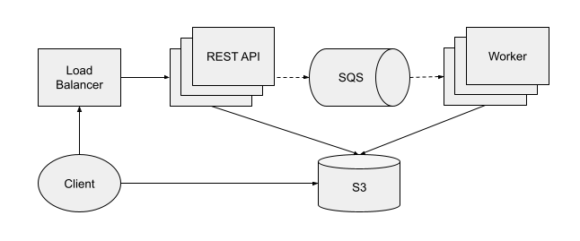
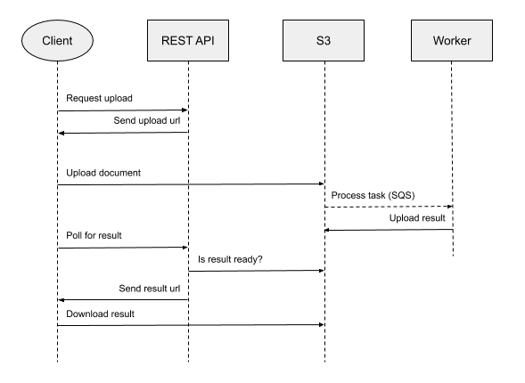

# Accountant

Accountant is a fictional application for extracting structured data from bank account statements in PDF. It showcases simple distributed app design and implementation on AWS.

## Architecture Overview



Application is split into two components:
* **[REST API](web.py)** - public facing web application, serving clients and generating S3 links
* **[Worker](worker.py)** - application processing async tasks, extracting data from PDF documents

Both components are stateless, which allows them to be easily scalable based on demand. REST API runs a simple Python web server with JSON API. It generates presigned S3 links to upload documents and download results. It checks S3 for the results, but never blocks. The actual document parsing is done by worker instances, which run on demand based on number of messages in the SQS queue. The queue is notified about new tasks automatically, everytime a user uploads new document.

## Document Lifecycle



Each document is tracked using UUID, which is generated when the user requests upload URL. After that it's used to check the result. All documents and results are available on S3, which is used as primary storage. Users comunicate directly with S3 using generated presigned links. This way we don't need any other shared storage for components which makes deployment simpler.

## API

#### GET /
```json
200 OK
{
  "root": {
    "links": {
      "upload": "/api/documents"
    }
  }
}
```

#### POST /api/documents
```json
201 Created
{
  "documentUpload": {
    "uploadUrl": "presigned-upload-url",
    "uploadHeaders": {
      "x-amz-meta-documentType": "document:kb:pdf"
    },
    "uploadCurl": "curl -X PUT -H 'x-amz-meta-documentType: document:kb:pdf' --upload-file filename <presigned-upload-url>",
    "links": {
      "result": "/api/documents/<document-id>"
    }
  }
}
```

#### GET /api/documents/document-id
```json
404 Not Found (Document not found)

202 Accepted  (Result is not ready)

200 OK        (Result is ready)
{
  "documentResult": {
    "resultUrl": "<presigned-result-url>",
    "resultCurl": "curl <presigned-result-url>",
    "links": {
      "result": "/api/documents/<document-id>"
    }
  }
}
```

## Deployment

Application is deployed on AWS using [Cloud Development Kit (CDK)](https://aws.amazon.com/cdk/). The actual deployment configuration is in [accountant-infra](https://github.com/kupcimat/accountant-infra) repository. Both Python applications are packaged as Docker containers to be more independent on the runtime environment and allow easier local testing. They are deployed to AWS [Fagate](https://aws.amazon.com/fargate) serverless compute engine for easy deployment and auto-scalability. The application is relying on the following AWS services:
* **S3** to store uploaded documents and results
* **SQS** to automatically distribute document parsing tasks among workers
* **ECS** using Fargate to deploy, run and scale containers
* **ECR** to store containers, which are then deployed to ECS

### Security

Most services use encryption and users with least privilege. It probably could be improved, because the CDK abstractions setup everything, including IAM roles, which could be defined explicitly to review all required permissions.

## CI/CD

Testing and deployment pipelines are implemented using GitHub Actions. Every commit to `master` needs to pass the tests first, which are run automatically for every pull request. Deployemnt to AWS is done for now by creating new release, which automatically triggers pipeline to create new Docker images and deploy them to AWS without downtime. It could be further improved by running healthcheck/integration tests after deployment. The following pipelines are implemented:
* **[CI](.github/workflows/ci.yml)** - runs unit lint and unit tests for the Python code, also builds Docker images and runs [container structure tests](https://github.com/GoogleContainerTools/container-structure-test)
* **[AWS Deploy](.github/workflows/aws-deploy.yml)** - builds and tags new Docker images and then deploys them to ECS

### Integration Tests

There are two [integration tests](test/e2e_test.py) which require running application and can test the the whole document lifecycle. You can run them locally with the application using [docker-compose.yaml](docker-compose.yaml), but it requires to setup S3 and SQS services on AWS. I think they could be replaced by [localstack](https://github.com/localstack/localstack) in the future, to run the integration tests locally without AWS dependencies. The same tests could be also used to verify the production deployment.

## Extensibility

Adding new types of documents shouldn't be too complicated. The REST API already [adds metadata](accountant/web/routes.py#L42) to every uploaded document, which is stored together with the document on S3. The worker then could retrieve it and process the document accordingly. The existing API could be extended to allow to specify document type:

#### POST /api/documents
```json
{
  "documentRequest": {
    "documentType": "document:kb:pdf"
  }
}

201 Created
{
  "documentUpload": {
    "uploadUrl": "presigned-upload-url",
    "uploadHeaders": {
      "x-amz-meta-documentType": "document:kb:pdf"
    },
    "uploadCurl": "curl -X PUT -H 'x-amz-meta-documentType: document:kb:pdf' --upload-file filename <presigned-upload-url>",
    "links": {
      "result": "/api/documents/<document-id>"
    }
  }
}
```